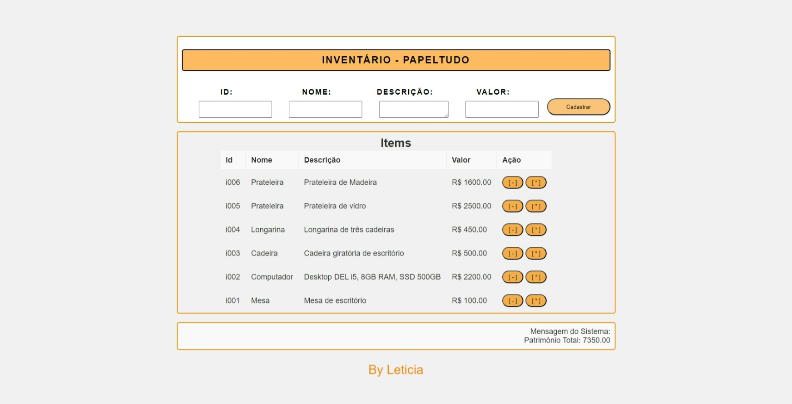

# Papel_Tudo
 - Projeto Full stack (MySQL, NodeJS, JS).
  
## Sobre o Projeto Papel_Tudo

- Esse projeto é um inventário de uma loja, onde o funcionário irá inserir todos os itens da loja ficando assim mais organizado, pratico e rápido.

## Técnologias
- NodeJS;
- Mysql / MariaDB (XAMPP);
- Live Server.

## Como testar
- **1.** Clone este repositório;
- **2.** Abra com VsCode;
- **3.** Abra o XAMPP e clique em Start no MySQL;
- **4.** Abra o banco de dados via shell ou phpMyadmin e rode o **script.sql** para criar e popular o banco de dados;
- **5.** Abra o terminal (CMD ou BASH);
    - **5.1** Naveque até a pasta **./api** e instale as dependências
```bash
- cd back
- npm i
```
- **6.** Inicie o Back-End, com um dos comandos abaixo;
```bash
- node server.js
- nodemon
- npx nodemon
```
**7.** - Acesse a pasta **front** e execute o index.html via Live Server.

# Como são as páginas:

## Página Inicial:
  


## Página onde irá cadastrar os produtos:
  

